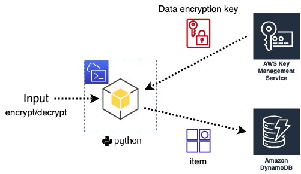

# Security Best Practices - KMS Demo

In this demo you will demonstrate how to perform client-side encrypt/decrypt operations on *strings* using `KMS SDK` client in a very simple scenario and running a couple of python scripts using the boto3 SDK.

*Diagram:*



## Setting up the environment

1. In AWS Console, go to KMS, choose Customer managed keys options in the left navigation menu and click on the **Create** key button.

    KMS key creation parameters:

    - Key type: Symmetric

    - Key usage: Encrypt and decrypt

    - Alias: `demo-kms-append-with-random`

    - Key administrator: *your session IAM user*

    - Define key usage permissions: *your session IAM user*

    - Review and select **Finish**

    - Copy/paste the `Key ID` in a notepad, you will use it in the next steps.

1. Create a DynamoDB table. This table will be used to store the user's encrypted password.

    DynamoDB table parameters:

    - Table name: `demo-kms` # Please do not change table name, the python scripts have dependencies on this table name.

    - Partition key: `appuser` # Please do not change partition key id either, thank you.

    - Leave defaults and select **Create table**

1. Open **CloudShell** in a new browser tab.

1. Download encrypt and decrypt python script files

    ```sh
    curl -o decrypt-passwd.py https://raw.githubusercontent.com/gcanales75/demo-kms/main/decrypt-passwd.py
    curl -o encrypt-passwd.py https://raw.githubusercontent.com/gcanales75/demo-kms/main/encrypt-passwd.py
    ```

1. Prior to running the scripts, you can display their content on screen and explain them to the class

    ```sh
    cat encrypt-passwd.py
    ````

    Repeat with the decrypt script file.

1. To encrypt a password *string* run the below command:

    ```sh
    python3 encrypt-passwd.py mySuperSecretPasswd [replace-me-with-the-kms-key-id]
    ```

    Replace `mySuperSecretPasswd` with a different password string and `replace-me-with-the-kms-key-id` with the actual **Key ID** you previously paste in a notepad in a previous step (remove brackets `[]`).

    You must see a similar output:

    ```sh
    -->> Encrypting your very secret password
    A new encrypted password for user: xxxxx has been stored in DynamoDB
    ```

    > This command passes the desired password as an argument to the python script. The script then encrypts this password using the KMS data key - also provided by you in argument list - and write the encrypted password to the `demo-kms` table using the `PutItem` method of DynamoDB SDK API. The script also generates a random number to save as the Partition Key value (appuser).

1. Go to DynamoDB and explore the item in the table `demo-kms`. You must see an item with the user number similar to the CloudShell stdout. You will also notice the `userpasswd` value is encrypted.

1. Now you will retrieve the encrypted password from the DynamoDB demo-kms table and decrypt it running a second python script which references the `appuser` value (Partition key). Run the below command replacing the `user` placeholder with the actual `user` number displayed after the execution of the encryption script. Also replace the `replace-me-with-the-kms-key-id` placeholder with the actual Key ID you previously paste in a notepad (remove brackets `[]`).

    ```sh
    python3 decrypt-passwd.py [replace-with-appuser-number] [replace-me-with-the-kms-key-id]
    ```

    You must see a similar output:

    ```sh
    -->> Decrypting the very secret password for user: xxxxx
    Is this your decrypted password? -> mySuperSecretPasswd
    ```

    > This command passes the `appuser` and the **KMS** key id as arguments to the python script. The script then retrieves the encrypted password from the `demo-kms` DynamoDB table using the `GetItem` method of the SDK, passing the `appuser` Partition key. After the API responds, the script decrypts the encrypted password using the `KMS SDK` client and prints in the stdout the operation response.

### Highlight

1. Customers can protect information such as PII or any sensitive data, prior to being transmited to a storage service over a network (client-side encryption) using KMS encryption keys embedding the `KMS SDK` client in their applications code.

### Clean up your account

1. Go to the **KMS** and schedule for deletion the **KMS** managed key used for this demo. Use this opportunity to understand why it is not allowed to immediately delete a **KMS** key.

    > Deleting a KMS key is a destructive and potentially dangerous operation. When a KMS key is deleted, all data that was encrypted under the KMS key is unrecoverable. (The only exception is a multi-Region replica key). To prevent the usage of a KMS key without deleting it, you can just disable it using the DisableKey option.

    > Schedules the deletion of a KMS key. By default, KMS applies a waiting period of 30 days, but you can specify a waiting period of 7-30 days. When this operation is successful, the key state of the KMS key changes to PendingDeletion and the key can't be used in any cryptographic operations. It remains in this state for the duration of the waiting period. Before the waiting period ends, you can use CancelKeyDeletion to cancel the deletion of the KMS key. After the waiting period ends, KMS deletes the KMS key, its key material, and all KMS data associated with it, including all aliases that refer to it.

    Alternately you could run this `aws cli` command to schedule the key deletion:

    ```sh
    aws kms schedule-key-deletion --key-id replace-me-with-the-key-id --pending-window-in-days 7
    ```

1. Delete the DynamoDB table from the Web console or run from **CloudShell**: `aws dynamodb delete-table --table-name demo-kms`

### END